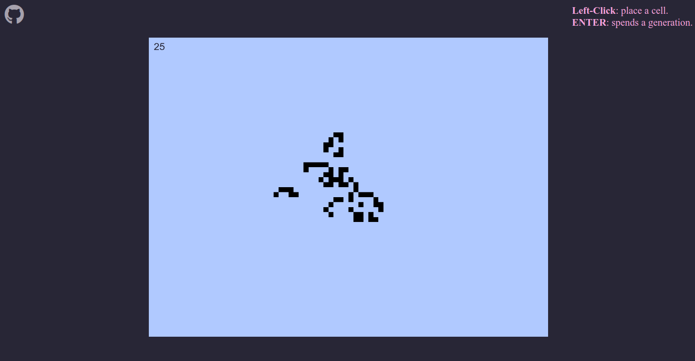

# Game of Life

My version of Conway's [Game of Life](https://en.wikipedia.org/wiki/Conway%27s_Game_of_Life).

> The Game of Life, also known simply as Life, is a cellular automaton devised by the British mathematician John Horton Conway in 1970.

The evolution of a given cell for the next generation is based on the same rules that Conway established :
* Any live cell with *fewer than two* live neighbors **dies**, as if by under population,
* Any live cell with *two or three* live neighbors **lives** on to the next generation,
* Any live cell with *more than three* live neighbors **dies**, as if by overpopulation,
* Any dead cell with *exactly three* live neighbors becomes a **live** cell, as if by reproduction. 


#### [View live](https://aihe.github.io/game-of-life/)

## Getting Started

You just need to `git clone` the repo:

```bash
git clone git@github.com:aihe/game-of-life.git
cd game-of-life
```

Then open "index.html" with your favorite browser.

If you want to modify the game variables, update the values present in the `/js/consts.js` file.
	
## Todo one day

* Add pre-made starting situations,
* Add a menu to change settings,
* Add a button to clear the window.

> "one day"

*( ͡° ͜ʖ ͡°)*

## About

Library : [p5js](https://p5js.org/) 
